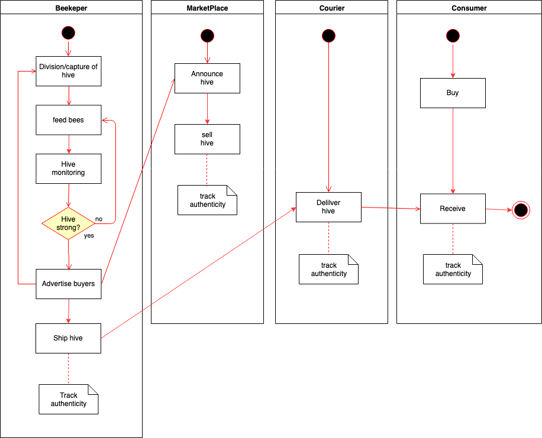
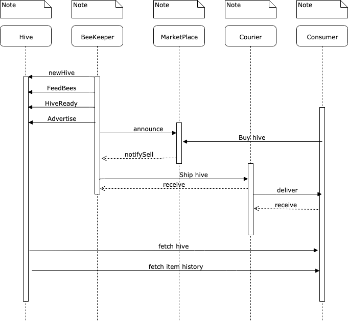
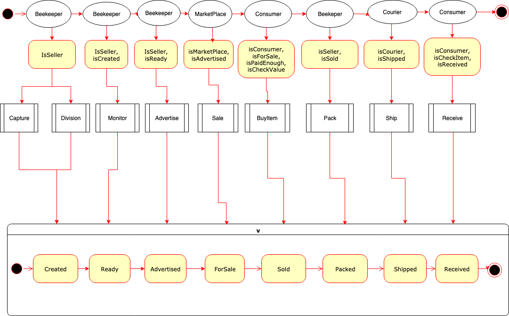
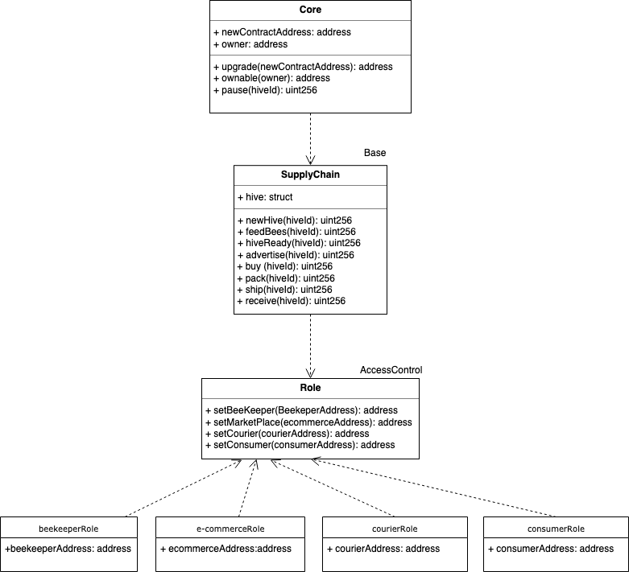

# Supply chain & data auditing

This repository containts an Ethereum DApp that demonstrates a Supply Chain flow between a Beekeeper (Seller), a MarketPlace, a courier and a Buyer. The user story is similar to any commonly used supply chain process. A Seller can add items to the inventory system stored in the blockchain. A Buyer can purchase such items from the inventory system. Additionally a Seller can mark an item as Shipped, and similarly a Buyer can mark an item as Received.

## Project write-up 
### UML








### Libraries
No external libraries have been used. Frameworks version:
- Truffle v4.1.15 - a development framework for Ethereum
- Node v10.13.0
- Ganache CLI v6.4.5 (ganache-core: 2.5.7)

## Part 2: Write smart contracts
In order to create your supply chain DApp, you will need to properly manage user permissions and track a product’s authenticity.

The smart contract(s) you build should have these requirements:

###  Requirement 1 	Define and implement interfaces: 
Review all the files. Add in any interfaces you use. 

### Requirement 2 	Build out AccessControl Contracts: Build out these contracts so that each actor’s role in your supply chain is distinct with no overlap in their access abilities. 
The Following contracts were created, inheriting from Role.sol:  
    BeekeeperRole.sol (already existed as FarmerRole.sol): The Beekeeper can create new hives through division or capture, feed and monitor them until ready for shipping, advertise them and track authenticity.
    ConsumerRole.sol: The Consumer can buy hives and track authenticity.
    CourierRole.sol: The Courier can deliver itens and track authenticity.
    MarketPlaceRole.sol: The MarketPlace can announce and sell hives and track authenticity
   
### Requirement 3 	Build out Base Contract
    Base - SupplyChain.sol: This is where we define the most fundamental code shared throughout the core functionality. This includes our main data storage, constants and data types, plus internal functions for managing these items.

### Requirement 4 	Build out Core Contract
    Core - Ownable.sol: is the contract that controls ownership and transfer of ownership.

## Part 3: Test smart contract code coverage
Requirement: Smart contract has associated tests

Every function  implemented from your Sequence Diagram was tested:
*  Smart contract function 'createItem()' that allows a beekeeper to create a hive
*  Smart contract function 'HiveReady' that allows a beekeeper to mark an item 'Ready'
*  Smart contract function 'advertiseItem' that allows the beekeeper to mark an item 'Advertised'
*  Smart contract function 'sellItem' that allows a MarketPlace to mark an item 'ForSale'
*  Smart contract function 'buyItem' that allows the Seller to mark an item 'Sold'
*  Smart contract function 'packItem' that allows a farmer to mark an item 'Packed'
*  Smart contract function 'shipItem' that allows the courier to mark an item 'Shipped'
*  Smart contract function 'receiveItem' that allows the consumer to mark an item 'Received'
*  Smart contract function fetchItemBufferOne() that allows anyone to fetch item details from blockchain
*  Smart contract function fetchItemBufferTwo() that allows anyone to fetch item details from blockchain


Please make sure you've already installed ganache-cli and Truffle. 
Clone this repository:
```
git clone https://github.com/anmi404/project-6/
```
Change directory to ```project-6``` folder and install all requisite npm packages (as listed in ```package.json```):

```
cd project-6
npm install
```
To test in a locally running blockchain, launch Ganache:
```
ganache-cli -m "spirit supply whale amount human item harsh scare congress discover talent hamster"
```

thing beauty giggle lonely choice blind test era parent balcony menu napkin

In a separate terminal window, Compile and test the smart contracts:

```
truffle compile
truffle migrate
truffle test
````
All 10 tests should pass.

### Deploy your Contract to Rinkeby

In order to deploy the contract to the Rinkeby Public Network, you need to configure file truffle-config.js (or truffle.js). 
To that end the following steps can be followed:
1. Get the endpoint address from https://infura.io: Create a new project and choose the Rinkeby network from the Endpoints menu. Copy the address and paste the infura key into the truffle.js file. 
2. Uncomment the line: 
```
const HDWalletProvider = require('truffle-hdwallet-provider'); 
```
3. Copy the mnemonic returned by Metamask to constant __mnemonic__. 
4. Insert the following lines into the networks table:
```
rinkeby: {
        provider: () => new HDWalletProvider(mnemonic, `https://rinkeby.infura.io/v3/${infuraKey}`),
          network_id: 4,       // rinkeby's id
          gas: 4500000,        // rinkeby has a lower block limit than mainnet
          gasPrice: 10000000000
        },
```
5. Setup a valid Rinkeby account in Metamask.

### Testing the project
In order to test the project in the local network, run:
```
truffle migrate --reset
truffle test --network develop
```
To execute in the rinkeby network the contract run command:
```
truffle migrate --reset --network rinkeby
```
* Transaction Hash:  0x248f0bf0b0db4bb7a685307d3dec781116c21ae7063b9394dab72a3b40ebe438 
* Contract address: https://rinkeby.etherscan.io/address/0x4D0dF32F22F2081a2B01Cd0C6b70c7E154c04507

### Part 5: Modify client code to interact with smart contract
Create the frontend that allows your users to interact with your DApp. This should be a simple and clean frontend that manages product lifecycle as the product navigates down the supply chain.

## Built With
* [Ethereum](https://www.ethereum.org/) - Ethereum is a decentralized platform that runs smart contracts
* [Truffle Framework](http://truffleframework.com/) - Truffle is the most popular development framework for Ethereum with a mission to make your life a whole lot easier.

## Authors

See also the list of [contributors](https://github.com/anmi404/project-6/contributors.md) who participated in this project.

## Acknowledgments

* Solidity
* Ganache-cli
* Truffle

